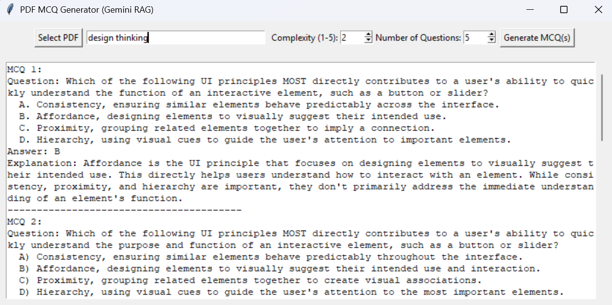

# PDF MCQ Generator (Gemini RAG)

This project is a Python GUI application that generates multiple-choice questions (MCQs) from the content of a PDF file using Google's Gemini (Generative AI) and LangChain's Retrieval-Augmented Generation (RAG) approach.

## Features

- Select any PDF file from your computer.
- Enter a topic and select a complexity level (1-5).
- Generate MCQs based on the PDF content and your topic.
- View the generated question, options, answer, and explanation in the GUI.

## Requirements

- Python 3.8+
- [Google Gemini API Key](https://aistudio.google.com/app/apikey)
- The following Python packages:
  - `langchain`
  - `langchain-google-genai`
  - `pypdf`
  - `tkinter` (comes with Python standard library)

Install dependencies with:

```sh
pip install langchain langchain-google-genai pypdf
```

## Usage

1. **Set your Gemini API key**  
   - You can set it as an environment variable named `GEMINI_API_KEY`:
     ```sh
     set GEMINI_API_KEY=your_actual_api_key_here
     ```
   - Or directly edit the code to insert your API key.

2. **Run the application**

   ```sh
   python generator_rag.py
   ```

3. **Use the GUI**
   - Click "Select PDF" and choose your PDF file.
   - Enter a topic (e.g., "Photosynthesis").
   - Choose a complexity level (1-5).
   - Click "Generate MCQ" to get your question.

## Screenshot

Add a screenshot of the running application here (for example):



## Security Note

**Never share your Gemini API key publicly.**  
Remove or mask your API key before publishing code.

## License

MIT License

---

**Example Output:**

```
Question: Which of the following is a direct product of the light-dependent reactions of photosynthesis that is subsequently used in the Calvin cycle?
  A. Glucose
  B. Carbon Dioxide
  C. Oxygen
  D. ATP and NADPH
Answer: D
Explanation: The light-dependent reactions of photosynthesis produce ATP and NADPH, which are then used as energy sources and reducing power, respectively, in the Calvin cycle to fix carbon dioxide and produce sugars. Glucose is a product of the Calvin cycle, not the light-dependent reactions. Oxygen is a byproduct of the light-dependent reactions, and carbon dioxide is a reactant in the Calvin cycle.
----------------------------------------
```